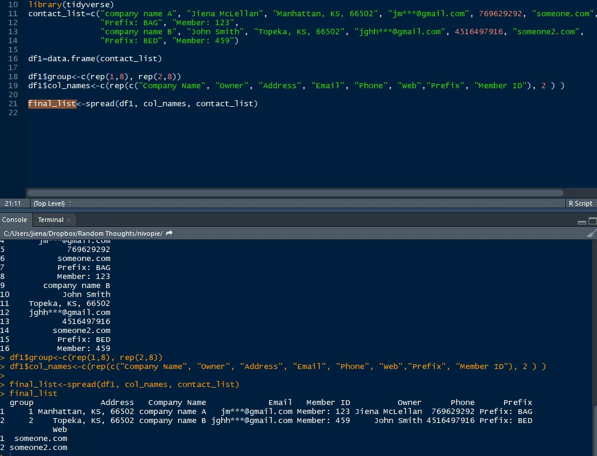

# tidyverse_examples
This repository is a showcase of all magic of using tidyverse

* example_long_wide.R:
  - This is a demo of long to wide data frame
  - Introduction: Usually, when you copy and paste a contact list from a contact book to a csv, you will have one column with all member's contact info (long format, very messy). Now you want to have a data frame with cols: company name; owner; address; emails; phone... So that you can sort the data. 
* Run example:
  -
